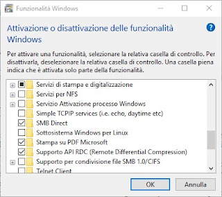

#################################
First step to set-up your machine
#################################

****************************
Set-up your terminal machine
****************************

If you have a MacBook just open the Terminal app and that's it!
If you a have a Windows-based computer you must download the app of `Ubuntu`_ in the Microsoft Store. 

.. _Ubuntu: https://www.microsoft.com/it-it/p/ubuntu/9nblggh4msv6?activetab=pivot:overviewtab

After that you have to enable the use of Linux in Windows: 
- From the Start menu, search "Programmi e funzionalità".
- Go to the menu "Attivazione/disattivazione delle funzionalità Windows".
- Check the box "Sottosistema Windows per Linux" to enable it (see the figure below).

Now you can open the app Ubuntu and use the textual shell **bash** in the terminal. 
`Here`_ you can find a quick reference to the basic commands in bash. 

.. _Here: https://drive.google.com/file/d/18v7EoQcg1ff3My4bypvjzkMUiIFrMkT2/view?usp=sharing

***********************************************
Install Miniconda to work on your local machine
***********************************************

To work locally you will have to install several programs and software packages. This can be done with a package manager **Miniconda**. 
To install Miniconda type the following commands: 
::

  wget https://repo.anaconda.com/miniconda/Miniconda3-py39_4.10.3-Linux-x86_64.sh
  bash Miniconda3-py39_4.10.3-Linux-x86_64.sh

Follow the procedure (type always yes if asked) and when asked about executing **conda init** type **yes**. 
Miniconda automatically install also **Python 3**.

 
