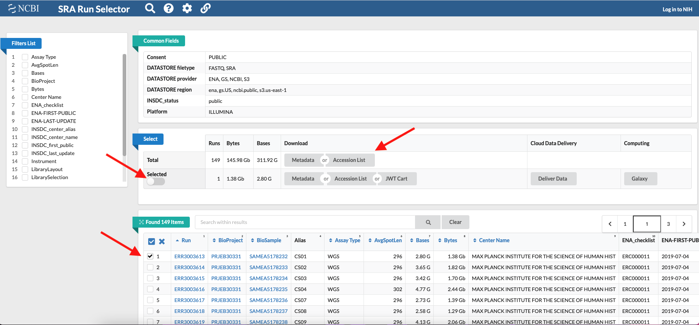

###############
Useful commands
###############

*******************************************
Download FASTQ sequencing data from the SRA
*******************************************

To download ``fastq`` sequences deposited in the Sequence Read Archive (SRA) of the NCBI we wil use **SRA Tools**. You can install `SRA Tools with Conda`_.

Go to the `SRA`_ website and search the accession number of the study you interested in (e.g. PRJEB30331). 
A list of all the sequences deposited under that accession number is returned, click on **Send results to run selector**. 
In the Run Selector all the details associated with the sequencing data are reported and you can select single samples/sequences by ticking the box next to each one. 
If you select any samples, remember to tick also the **Selected** button. Then click on the tab **Metadata**

.. _SRA: https://www.ncbi.nlm.nih.gov/sra
.. _SRA Tools with Conda: https://anaconda.org/bioconda/sra-tools

A file ``SRR_Acc_List.txt`` is downloaded containing the list of samples that you selected (the Run accession number), or the full list if you did not select any samples. 
The ``sra`` filea are  downloaded in a folder created by SRA Tools which normally has the following path: **~/ncbi/public/sra**.
To download the sequences type the following command: 
::

  cat SRR_Acc_List.txt | xargs -I{} prefetch {}

To extract the ``fastq`` sequences from the ``sra`` file use **fastq-dump**:
::

  fastq-dump --split-files --gzip *.sra

Validate the integrity of the ``sra`` file:
::

  vdb-validate SRR061294.sra

*****************************************
Download referece sequences from the NCBI
*****************************************

Download the ``assembly_summary.txt`` file from the RefSeq database for the taxonomic group of interest. You can download assemblies of different groups: 

ftp://ftp.ncbi.nlm.nih.gov/genomes/refseq/bacteria/assembly_summary.txt
ftp://ftp.ncbi.nlm.nih.gov/genomes/refseq/vertebrate_mammalian/assembly_summary.txt
ftp://ftp.ncbi.nlm.nih.gov/genomes/refseq/plant/assembly_summary.txt
ftp://ftp.ncbi.nlm.nih.gov/genomes/refseq/protozoa/assembly_summary.txt
ftp://ftp.ncbi.nlm.nih.gov/genomes/refseq/fungi/assembly_summary.txt
ftp://ftp.ncbi.nlm.nih.gov/genomes/refseq/bacteria/Yersinia_pestis/assembly_summary.txt

Keep in mind that the RefSeq content includes assembled genome sequence and annotation data. All RefSeq genomes have annotation. Subdirectories include:

  - archaea
  - bacteria
  - fungi
  - invertebrate
  - plant
  - protozoa
  - vertebrate_mammalian
  - vertebrate_other
  - viral
  - mitochondrion [Content is from the RefSeq release FTP site.]
  - plasmid [Content is from the RefSeq release FTP site.]
  - plastid [Content is from the RefSeq release FTP site.]

Once downloaded, we will used this file to retrieve the ftp address that contains the folder with the genome of the species we are looking for, plus many other files. 
You can open the assembly_summary file in a text editor and search the assemblies available the species of interest. 
Otherwise you can  explore the complete genomes and the latest assemblies for a peculiar species by piping ``grep`` and ``awk``. **AWK** is a scripting language for advanced text elaboration. You can find more infos in here (`italian`_, `english`_).  
::

  grep "Yersinia pestis" assembly_summary.txt | awk -F "\t" '$12=="Complete Genome" && $11=="latest"{print $0}'

.. _italian: https://riptutorial.com/awk
.. _english: https://noviello.it/come-usare-il-comando-awk-per-elaborare-un-testo-su-linux/

If too many results are returned you can pipe ``less``, and use the option -S to view the lines as unwrapped (they will be truncated if longer than the screen width): 
::

  grep "Yersinia pestis" assembly_summary.txt | awk -F "\t" '$12=="Complete Genome" && $11=="latest"{print $0}' | less
  grep "Yersinia pestis" assembly_summary.txt | awk -F "\t" '$12=="Complete Genome" && $11=="latest"{print $0}' | less -S

.. note:: 

  The print sintax in ``awk`` determines which column of the text file is displayed based on the column separator, which in turn is defined by the option ``-F`` (``"\t"`` stands for tab-delimited text). To display all the columns use $0, otherwise select the columns based on the order ($1,$2 to display the first two columns).

You can display only the columns corresponding to the ftp directory ($20), the organism name ($8) and the strain ($9), and copy the ftp path to the species directory of interest (this will be used in the ``rsync`` command below).
::

  grep "Yersinia pestis" assembly_summary.txt | awk -F "\t" '$12=="Complete Genome" && $11=="latest"{print $8,$9,$20}' | less

If you want, you can also redirect the output to a file (called here ``ftpdirpaths.txt``). 
::

  grep "Yersinia pestis" assembly_summary.txt | awk -F "\t" '$12=="Complete Genome" && $11=="latest"{print $8,$9,$20}' | ftpdirpaths.txt

In this example, the ftp path of the species of interest looks like this: 
**ftp.ncbi.nlm.nih.gov/genomes/all/GCF/001/717/545/GCF_001717545.1_ASM171754v1**

To download the ftp directory containing the reference sequence, we will use `rsync`_, a versatile file copying tool that can copy locally, to/from another host over any remote shell. Paste the ftp path to the following command to download the sequence: 
::

  rsync --copy-links --recursive --times --verbose rsync://ftp.ncbi.nlm.nih.gov/genomes/all/GCF/001/717/545/GCF_001717545.1_ASM171754v1 .

.. _rsync: https://linux.die.net/man/1/rsync

Inside the folder, the reference sequence that you will use for the alignment of your reads has the suffix ``_genomic.fna.gz``. 

